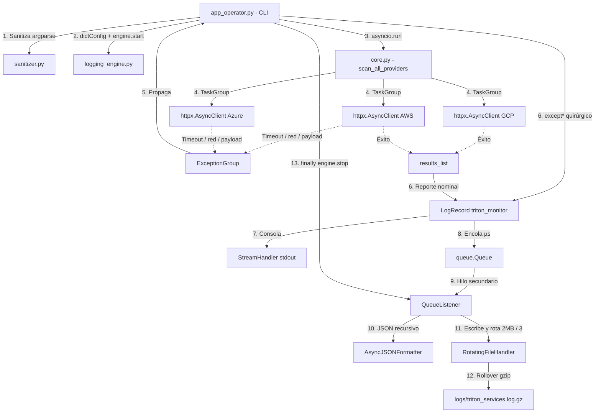

# TritonMonitor — Proyecto Tritón

Sistema de telemetría multicloud y observabilidad asíncrona.

CLI oficial que consulta en paralelo endpoints reales (JSONPlaceholder + httpbin), agrupa fallos concurrentes en un `ExceptionGroup` y los captura con `except*`. El I/O a disco corre fuera del event loop (`QueueHandler` + `QueueListener`), con rotación de 2 MB / 3 backups y compresión gzip.

## Requisitos

- Python 3.11+
- Dependencias:

```bash
python -m venv .venv
source .venv/bin/activate
pip install -r requirements.txt
```

## Estructura

```
triton_monitor/
├── src/
│   ├── app_operator.py                 # CLI / dictConfig / except* / finally
│   └── triton_telemetry/
│       ├── __init__.py
│       ├── exceptions.py               # TritonError y subclases
│       ├── sanitizer.py                # parse_timeout, parse_cluster_id
│       ├── core.py                     # httpx + asyncio.TaskGroup
│       └── logging_engine.py           # JSON forense + pipeline no bloqueante
├── requirements.txt
├── pyproject.toml
├── .gitignore
└── README.md
```

Ejecutar siempre con `PYTHONPATH=src` desde la raíz del repo.

## CLI

```text
python src/app_operator.py [-h]
    proveedores [proveedores ...]
    [-c CLUSTER_ID] [-t TIMEOUT]
    [-m {nominal,debug,emergency}]
    [--chaos]
    [--quiet | --verbose | --json-stdout]
```

| Argumento | Tipo | Default | Descripción |
|---|---|---|---|
| `proveedores` | posicional, 1..N | — | `AWS`, `Azure` y/o `GCP` |
| `-c / --cluster-id` | `parse_cluster_id` | `cluster-us-east-01` | Patrón `cluster-<region>-<numero>` |
| `-t / --timeout` | `parse_timeout` | `2.5` | Rango `0.1`–`5.0` segundos |
| `-m / --mode` | choices | `nominal` | `nominal`, `debug` o `emergency` |
| `--chaos` | flag | off | Inyecta timeout / HTTP 504 / payload no JSON |
| `--quiet` | excluyente | — | Consola solo ERROR+ |
| `--verbose` | excluyente | — | Consola DEBUG |
| `--json-stdout` | excluyente | — | Consola en JSON estructurado |

`--quiet`, `--verbose` y `--json-stdout` son mutuamente excluyentes.

Modo `emergency` activa caos aunque no se pase `--chaos`.

## Comandos de validación

### A. Operación nominal

```bash
PYTHONPATH=src python src/app_operator.py AWS GCP -c cluster-us-east-01 -t 3.0
```

Esperado: consultas paralelas a JSONPlaceholder, latencias reales, proceso en 0.

### B. Frontera CLI (sin red)

```bash
PYTHONPATH=src python src/app_operator.py AWS GCP -c cluster-invalido-id -t 9.5
```

Esperado: `argparse.ArgumentTypeError`, ayuda en stderr, exit code **2**. No arranca asyncio ni el listener.

### C. Inyección de caos (ExceptionGroup)

```bash
PYTHONPATH=src python src/app_operator.py AWS Azure GCP -c cluster-us-west-02 -t 1.5 --chaos
```

Esperado:

- AWS → timeout real (`httpbin.org/delay/3`) → `ProviderTimeoutError`
- Azure → HTTP 504 → `CorruptedPayloadError`
- GCP → XML en lugar de JSON → `CorruptedPayloadError`
- `except*` parte el grupo por tipo, imprime notas `add_note()` y **no aborta** de forma brusca
- `finally` apaga el `QueueListener`

### Otros

```bash
PYTHONPATH=src python src/app_operator.py AWS -c cluster-us-east-01 -m debug --verbose
PYTHONPATH=src python src/app_operator.py AWS Azure GCP -c cluster-sa-east-01 -m emergency --json-stdout
PYTHONPATH=src python src/app_operator.py -h
```

Logs de disco: `logs/triton_services.log` (rotado y gzippeado por el motor de observabilidad).

## Arquitectura (flujo de hilos)



## Roles

| Integrante | Archivo | Responsabilidad |
|---|---|---|
| 1 | `exceptions.py`, `sanitizer.py` | Excepciones semánticas y validadores CLI |
| 2 | `core.py` | `httpx.AsyncClient` + `asyncio.TaskGroup` + APIs reales |
| 3 | `logging_engine.py` (`AsyncJSONFormatter`) | JSON forense, ISO 8601 UTC, árbol de excepciones |
| 4 | `logging_engine.py` (`NonBlockingLoggingEngine`) | Cola, rotación, gzip |
| 5 | `app_operator.py` + empaquetado | Parser, `dictConfig`, `except*`, `finally` PEP 765 |
| 6 | suite de pruebas | Caos masivo y validador del `.gz` (si el grupo es de 6) |

## Hard gates

- No se captura `BaseException` ni se usa `except: pass`.
- `finally` no contiene `return`, `break` ni `continue` (PEP 765 / PIE790).
- El archivo de log no se abre en paralelo desde el hilo de asyncio: solo vía cola.
- `requirements.txt` aísla `httpx>=0.27.0`.
- Sin secretos en el repositorio.

## Lint

```bash
ruff check src
```

## Video explicativo
[](https://youtu.be/NnbD5y-rOP4)
